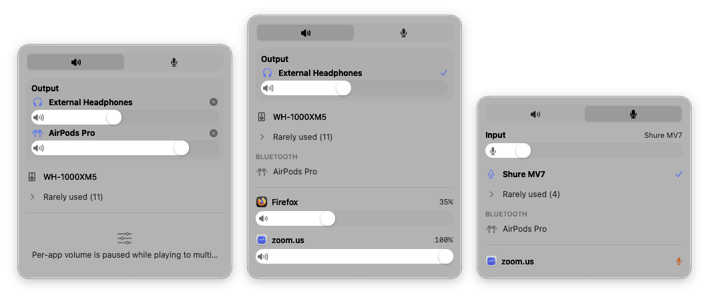

# Fader

[](https://github.com/pantafive/fader/actions/workflows/ci.yml) [](https://github.com/pantafive/fader/releases/latest) [](LICENSE)

A macOS menu bar app for audio output switching and per-app volume. Switch the output device in one click, connect Bluetooth headphones, set a separate volume for every app, and play audio to several devices at once. Site: [fader.pantafive.dev](https://fader.pantafive.dev).

<p align="center"></p>

No telemetry, no analytics. Per-app volume is processed on-device through Core Audio process taps (an API added in macOS 14.4), so there is no kernel extension and no virtual audio driver to install. Requires macOS 15+ on Apple silicon.

## Install

```sh
brew install --cask pantafive/tap/fader
```

Or download [the latest dmg](https://github.com/pantafive/fader/releases/latest/download/Fader.dmg).

Both channels stay current: the dmg updates itself through Sparkle, the cask through `brew upgrade`.

## Features

### Output devices

Headphones, speakers, displays, and AirPlay targets all appear in the popover, with the active one marked; one click on a row switches to it. Paired-but-disconnected Bluetooth headphones are listed too; clicking one connects it and routes audio there, and you disconnect from the same row.

Drag a device row to set its priority. The order becomes your auto-switch preference: when a higher-priority device connects Fader switches to it, and when the current default disappears Fader falls back to the best-ranked device still present. This stays dormant until you first reorder. Wired devices unused for 30 days collapse into a "Rarely used" group, and you can demote a row manually by dragging it onto the group.

### Several outputs at once

Drag a device row onto the Output section at the top and both devices play together: one movie, two pairs of headphones, one plane. Each device in the group gets its own volume slider; the ✕ removes one, and clicking any device row in the list routes everything back to that single device.

Fader builds this on the same multi-output device you could assemble by hand in Audio MIDI Setup, then removes it when you are done. Two things change while a group plays. The volume keys do nothing, because macOS gives a multi-output device no master volume — the per-device sliders replace them. And per-app faders pause, returning with their saved levels as soon as you are back on one output.

### Per-app volume

Every app that plays sound gets a volume fader and a mute toggle. Volumes persist across launches. An app left at 100% and unmuted is untouched: no tap, no processing, bit-perfect native playback. The tap exists only while a fader sits below full volume or an app is muted.

### Microphone

The microphone tab switches the default input and sets input gain. The gain slider disables itself on devices whose gain is hardware-only, so the control never lies about what it can do. It also shows which apps are using the microphone right now, so you can spot a forgotten recorder. That last part is an indicator only, because Core Audio exposes no per-app input gain.

### Throughout

System output volume and mute stay in sync with the volume keys and Control Center. Scrolling the wheel or trackpad over any slider adjusts it.

## Permissions

Most of Fader needs no permissions. Device switching, system volume, and the entire microphone tab work the moment you install. The one ask is for per-app volume, which uses a Core Audio process tap that macOS gates behind the System Audio Recording permission. Fader requests it only the first time you move an app's fader.

The permission's name sounds broader than what Fader does with it: the tapped audio is re-rendered to your output device with the gain applied and never leaves the Mac.

## Privacy

Fader collects nothing about you: no telemetry, no analytics. The claim is checkable — the source is open, read it.

## Development

```sh
brew install xcodegen swiftlint swiftformat
make run
```

Built in Swift 6 with strict concurrency. The Xcode project is generated by XcodeGen from `project.yml` and is not committed, so edit `project.yml` rather than the `.xcodeproj`. `make` drives local work: `gen`, `build`, `test`, `lint`, `format`, `run`.

CI lints and tests every push. Pushing a `v*` tag builds, signs, notarizes, and publishes the dmg and a signed Sparkle appcast as a GitHub release.

The real-time audio callback runs on the HAL IO thread. No allocation, locks, Objective-C, or logging is allowed inside it.

## Contributing

Bug reports and pull requests are welcome; for anything bigger than a fix, open an issue first. `make test` and `make lint` must pass. Commit messages follow [Conventional Commits](https://www.conventionalcommits.org), imperative mood, English.

Changes to the real-time audio callback get extra scrutiny for the constraints above. Contributions adding telemetry, analytics, or anything that phones home will be declined.

## Security

Report security issues privately via [GitHub security advisories](https://github.com/pantafive/fader/security/advisories/new), not public issues.

## License

[MIT](LICENSE)
