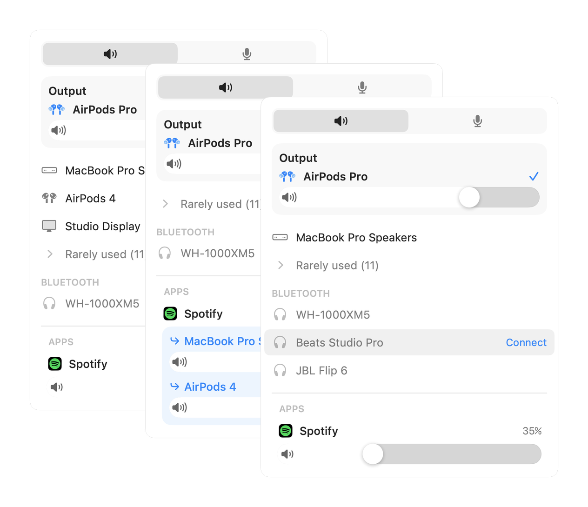

# Fader

[](https://github.com/pantafive/fader/actions/workflows/ci.yml) [](https://github.com/pantafive/fader/releases/latest) [](LICENSE)

A macOS menu bar app for audio output switching and per-app volume. Switch the output device in one click, connect Bluetooth headphones, set a separate volume for every app, and play audio to several devices at once. Site: [fader.pantafive.dev](https://fader.pantafive.dev).

<p align="center"><picture><source media="(prefers-color-scheme: dark)" srcset="docs/hero-dark.png"></picture></p>

No telemetry, no kernel extension, no virtual audio driver — the source is open, check for yourself. Requires macOS 15+ on Apple silicon.

## Install

```sh
brew install --cask pantafive/tap/fader
```

Or download [the latest dmg](https://github.com/pantafive/fader/releases/latest/download/Fader.dmg). The app updates itself.

## Features

- **Output switching** — headphones, speakers, displays, and AirPlay targets, one click each. Paired Bluetooth headphones connect from the same list.
- **Auto-switch** — drag rows to rank devices; Fader follows the best one present.
- **Several outputs at once** — drag a device onto the Output section and both play together, each with its own slider.
- **Per-app volume** — a fader and mute for every app that plays sound; levels persist. Apps at full volume play untouched, bit-perfect.
- **Per-app output** — drag one or more devices onto an app to play it through exactly those outputs, each with its own volume; everything else stays on your main output.
- **Microphone** — switch the default input, set gain, and see which apps are listening.
- **In sync** — system volume follows the volume keys and Control Center; scrolling over any slider adjusts it.

## Permissions

Only per-app volume needs one: macOS gates audio taps behind the System Audio Recording permission, requested the first time you move an app's fader. The tapped audio never leaves the Mac.

## Development

```sh
brew install xcodegen swiftlint swiftformat
make run
```

Swift 6, strict concurrency. The Xcode project is generated from `project.yml` — edit that, not the `.xcodeproj`. `make` drives local work: `gen`, `build`, `test`, `lint`, `run`, `clean`. Pushing a `v*` tag builds, signs, notarizes, and publishes a release.

## Contributing

Bug reports and pull requests are welcome; for anything bigger than a fix, open an issue first. `make test` and `make lint` must pass; commits follow [Conventional Commits](https://www.conventionalcommits.org). The real-time audio callback allows no allocation, locks, Objective-C, or logging — changes there get extra scrutiny. Anything that phones home will be declined.

## Security

Report security issues privately via [GitHub security advisories](https://github.com/pantafive/fader/security/advisories/new), not public issues.

## License

[MIT](LICENSE)
